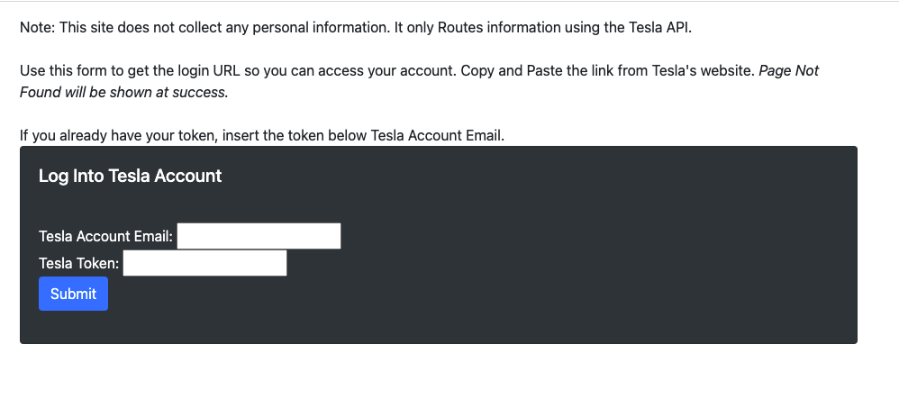
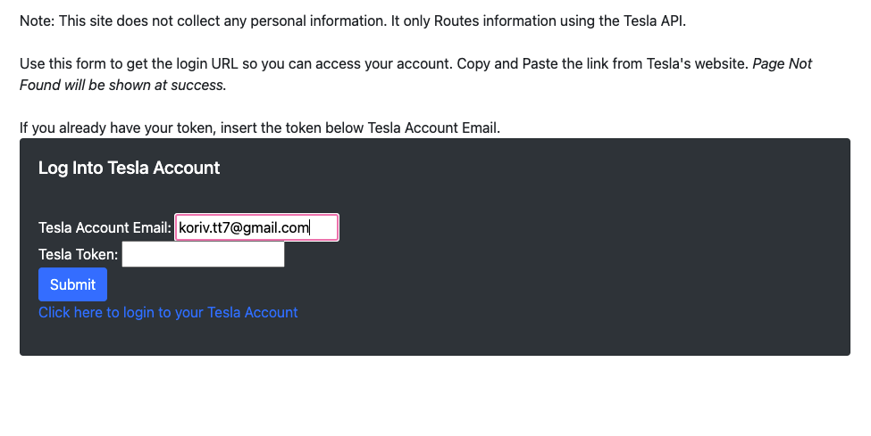

# tesla-fleet-manager

Install Requirements (teslapy, matplotlib)
```
pip3 install teslapy
```

Create `config.py` file that will contain your username and password.

The `config.py` file should look like this
```
email = YOUR@EMAIL.COM
password = YOURPASSWORD
```

Run the web app.
`python3 app.py`

<p align="center">
    Launch the interface.
  
</p>


<p align="center">
    Use the anchor tag "Click here to login to your Tesla Account" login to your Tesla Account.
  
</p>

<p align="center">
    Login to your Tesla Account.
  
</p>

<p align="center">
    Once you see a blank page after you have logged in, you're in the correct place. Copy and paste that link, along with your Tesla Account email into the web application and hit "Submit".
  
</p>

<p align="center">
    You will now see a dasboard view with the vehicles associated with your account.
  
</p>

<p align="center">
    You will now see a dasboard view with the vehicles associated with your account.
  
</p>